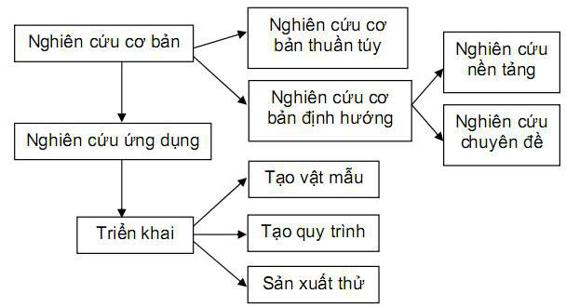

**Nghiên cứu cơ bản**

Là những nghiên cứu nhằm phát hiện thuộc tính, cấu trúc, động thái các sự vật, tương tác trong nội bộ sự vật và mối liên hệ giữa sự vật với các sự vật khác. Sản phẩm của nghiên cứu cơ bản có thể là các khám phá, phát hiện, phát minh, dẫn đến việc hình thành một hệ thống lý thuyết có giá trị tổng quát, ảnh hưởng đến một hoặc nhiều lĩnh vực khoa học.

vd: Nhà lí luận dạy học nghiên cứu quá trình dạy học, các nguyên tắc dạy học...

**Nghiên cứa ứng dụng**

Là sự vận dụng quy luật được phát hiện từ nghiên cứu cơ bản để giải thích một sự vật; tạo ra những nguyên lý mới về các giải pháp và áp dụng chúng vào sản xuất và đời sống. Để có thể đưa kết quả nghiên cứ ứng dụng vào sử dụng thì còn phải tiến hành một loại hình nghên cứu khác, có tên gọi là triển khai.

vd: Các nhà lí luận dạy học bộ môn vận dụng vào việc tìm kiếm một cấu trúc sách giáo khoa với nội dung phù hợp cho lứa tuổi, cho thời đại...

**Nghiên cứu triển khai**

Là sự vận dụng các quy luật(thu được từ nghiên cứu cơ bản) và các nguyên lý(thu được từ nghiên cứu ứng dụng) để đưa ra các hình mẫu với những tham số khả thi về kỹ thuật. Sản phẩm của triển khai chỉ mới là những hình mẫu khả thi kỹ thuật, nghĩa là không còn rủi ro về mặt kỹ thuật. Để áp dụng được, còn phải tiến hành nghiên cứu những tính khả thi khác, như khả thi tài chính, khả thi kinh tế, khả thi môi trường, khả thi xã hội.

vd: Các nhà lí luận dạy học, giáo viên... triển khai bộ SGK ở một số trường, một số khu vực. Họ tiếp tục nghiên cứu, điều chỉnh... để có bộ SGK cho toàn quốc 

